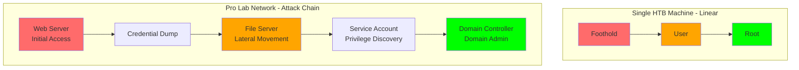
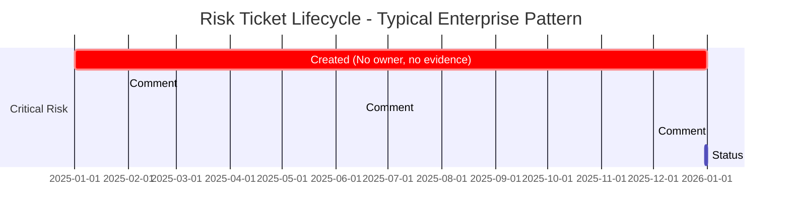

# Visual Specifications: From HackTheBox to the Boardroom

**Post:** `drafts/blog/001-hackthebox-to-boardroom.md`
**Generated:** 2026-02-15
**Visual budget:** 6 visuals (1 hero + 4 inline + 1 social card)

---

## Hero Image

**Type:** Split-screen conceptual illustration

**Concept:** A visual bridge between two worlds. Left side shows a terminal window with HTB-style reconnaissance output (nmap scan, directory enumeration). Right side shows a risk register interface or boardroom context (risk matrix, impact severity ratings). The two sides are connected by a visual element (bridge, arrow, or flow) suggesting methodology transfer. Dark background with high contrast text to match bksp.ca aesthetic.

**Suggested approach:**
1. **Primary:** Custom composition using Figma or Photoshop
   - Left: Screenshot of actual nmap/gobuster output (anonymized)
   - Right: Mock-up of a risk register UI or simple risk matrix table
   - Bridge element: Glowing connection line or shared methodology icons
   - Color palette: Terminal green (#00FF00) + risk matrix red/amber/green with neutral dark background

2. **Alternative:** Unsplash abstract tech image + text overlay
   - Search terms: "network security abstract", "data visualization dark", "system architecture"
   - Add text overlay: "From HackTheBox to the Boardroom"
   - Less literal but faster to produce

**Dimensions:** 1200x630px minimum (Open Graph compatible)
**Alt text:** "Split view showing HackTheBox terminal output on left and enterprise risk register on right, connected by a visual bridge representing methodology transfer"

---

## Inline Visual 1: The HTB → Risk Management Mapping Table

**Location:** Section "The Mapping" (after line 22)

**Type:** Comparison table with visual hierarchy

**Purpose:** Clarifies the four parallel comparisons currently presented in prose. A structured visual makes the mapping immediately scannable and reinforces that these are direct 1:1 transfers.

**What to show:**

| HTB Methodology | Enterprise Risk Management | Current Gap |
|---|---|---|
| **Enumeration before assumption**<br/>Port scan, service detection, define attack surface with specificity | **Evidence-based scoping**<br/>Document affected systems, quantify exposure, define scope precisely | "We think this is medium-severity"<br/>(intuition, not data) |
| **Proof before claims**<br/>Show the shell, data exfiltration, privilege escalation | **Quantified impact**<br/>Affected user count, regulatory framework, documented incidents | "Could result in significant exposure"<br/>(claim without evidence) |
| **Documentation that reproduces**<br/>Walkthrough methodology, show dead ends, enable reproduction | **Reproducible analysis**<br/>Evidence trail, methodology shown, severity derivation documented | "Severity: High. Fix it."<br/>(conclusion without reasoning) |
| **Chains, not silos**<br/>Pivot through attack paths, map lateral movement | **Attack chain mapping**<br/>Link vulnerabilities across systems, map exploitation paths | Each risk evaluated in isolation<br/>(no chain analysis) |

**Suggested tool:** Markdown table with Tailwind CSS styling (Astro supports this natively)

**Styling notes:**
- Bold the phase names (left two columns)
- Use color coding for "Current Gap" column (red/amber to signal problem)
- Alternating row backgrounds for readability
- Mobile-responsive: Stack columns vertically on small screens

**Implementation code:**

```markdown
| HTB Methodology | Enterprise Risk Management | Current Gap |
|---|---|---|
| **Enumeration before assumption**<br/>Port scan, service detection, define attack surface with specificity | **Evidence-based scoping**<br/>Document affected systems, quantify exposure, define scope precisely | ⚠️ "We think this is medium-severity"<br/>(intuition, not data) |
| **Proof before claims**<br/>Show the shell, data exfiltration, privilege escalation | **Quantified impact**<br/>Affected user count, regulatory framework, documented incidents | ⚠️ "Could result in significant exposure"<br/>(claim without evidence) |
| **Documentation that reproduces**<br/>Walkthrough methodology, show dead ends, enable reproduction | **Reproducible analysis**<br/>Evidence trail, methodology shown, severity derivation documented | ⚠️ "Severity: High. Fix it."<br/>(conclusion without reasoning) |
| **Chains, not silos**<br/>Pivot through attack paths, map lateral movement | **Attack chain mapping**<br/>Link vulnerabilities across systems, map exploitation paths | ⚠️ Each risk evaluated in isolation<br/>(no chain analysis) |
```

**Alternative:** If table feels too dense, use a 2x2 grid layout with cards (Tailwind grid with `md:grid-cols-2`)

---

## Inline Visual 2: Attack Chain Diagram (Linear vs. Network)

**Location:** Section "Chains, not silos" (around line 50, after "But in a Pro Lab...")

**Type:** System architecture / flow diagram

**Purpose:** Visualizes the difference between single-machine linear exploitation and multi-system attack chain pivoting. Makes concrete the abstract concept of "thinking in attack chains."

**What to show:**

**Part A: Single Machine (Linear)**
```
Foothold → User → Root
```

**Part B: Pro Lab Network (Chain)**
```
Web Server (foothold) → Credential Dump
                              ↓
                    File Server (pivot) → Service Account
                              ↓
                    Domain Controller (escalation) → Domain Admin
```

**Suggested tool:** Mermaid.js (embeddable in Markdown)

**Implementation code:**



**Alternative:** Hand-drawn diagram in Excalidraw with arrows and boxes, exported as SVG. Style: rough/sketch aesthetic (inspired by Martin Fowler's diagrams).

**Color coding:**
- Red: Initial access
- Amber: Intermediate steps
- Green: Final objective

---

## Inline Visual 3: The Risk Ticket Graveyard

**Location:** Opening section (after line 15, before "The Mapping")

**Type:** Timeline diagram showing ticket lifecycle decay

**Purpose:** Visualizes the "graveyard of good intentions" metaphor. Shows a risk ticket's journey from creation through aging without resolution.

**What to show:**

```
Day 1          Month 1        Month 6        Month 12
  |              |              |              |
Created      "This is      "Still on      Comment:
             important"    our radar"     "Any updates?"
  |              |              |              |
  └──────────────┴──────────────┴──────────────┴─→ No resolution
```

**Details to include:**
- Severity badge (Critical/High) shown at creation
- Comment count increasing over time
- No owner assigned
- Status stuck at "Open" or "In Review"
- Visual decay: Color fading from red (urgent) to gray (forgotten)

**Suggested tool:** CSS timeline with HTML/Tailwind or Mermaid gantt chart

**Implementation code (Mermaid):**



**Alternative:** Simple horizontal bar chart showing "Time to Resolution" with a single bar extending beyond the visible range, labeled "365+ days (still open)"

---

## Inline Visual 4: Writeup Quality Comparison

**Location:** Section "Documentation that reproduces" (after line 46)

**Type:** Side-by-side comparison (screenshot or formatted text blocks)

**Purpose:** Shows the stark difference between a quality HTB writeup and a typical enterprise risk report. Makes the documentation gap visceral and immediately recognizable.

**What to show:**

**Left side: HTB Writeup (Good)**
```
Machine: Ghoul
Difficulty: Hard

ENUMERATION:
- nmap: 22 (SSH), 80 (HTTP), 8080 (Tomcat)
- Subdomain discovery: chat.ghoul.htb, admin.ghoul.htb
- Found upload functionality on chat subdomain

FOOTHOLD:
- Zip slip vulnerability in chat upload (CVE-2018-1000031)
- Uploaded malicious archive with path traversal
- Shell as www-data

USER:
- Enumerated /var/www/html/config.php
- Found hardcoded MySQL credentials
- Pivoted to user 'kaneki' via credential reuse

ROOT:
...methodology continues...
```

**Right side: Typical Risk Report (Bad)**
```
RISK-2024-0142
Severity: High
Status: Open (365 days)

Description:
Web application may be vulnerable to upload attacks.
This could result in significant security exposure.

Recommendation:
Implement security controls for file uploads.

Assigned to: [None]
Evidence: [None]
Impact quantification: [None]
```

**Suggested tool:** Two code blocks side-by-side with Carbon.sh styling or simple markdown code fences with contrasting backgrounds

**Styling notes:**
- Left (good): Green border, structured, detailed
- Right (bad): Red border, vague, sparse
- Desktop: side-by-side
- Mobile: stacked

**Alternative:** Don't screenshot, just use formatted markdown blocks with clear visual separation (background color difference)

---

## Inline Visual 5: Enumeration Depth Comparison

**Location:** Section "Enumeration before assumption" (around line 28)

**Type:** Data visualization - depth comparison chart

**Purpose:** Quantifies the difference between "assumed scope" and "enumerated scope" to show why enumeration matters.

**What to show:**

A simple bar chart comparing:
- **Assumed attack surface:** "Probably just the web server" (1 component)
- **Actual attack surface (after enumeration):** Web server + API endpoints + subdomain + admin panel + file upload + database (6+ components)

**Suggested tool:** Observable Plot or Chart.js

**Implementation code (Observable Plot):**

```javascript
Plot.plot({
  marginLeft: 150,
  x: {label: "Attack Surface Components"},
  marks: [
    Plot.barX([
      {approach: "Assumption-based", components: 1},
      {approach: "Enumeration-based", components: 6}
    ], {
      y: "approach",
      x: "components",
      fill: (d) => d.approach === "Enumeration-based" ? "#00ff00" : "#ff6b6b"
    }),
    Plot.text([
      {approach: "Assumption-based", components: 1, label: "1 component"},
      {approach: "Enumeration-based", components: 6, label: "6+ components"}
    ], {
      y: "approach",
      x: "components",
      text: "label",
      dx: 20
    })
  ]
})
```

**Alternative:** Simple horizontal bar chart image generated via any tool (Google Sheets, Datawrapper, or even ASCII art for minimal aesthetic)

**Skip if:** The mapping table (Visual 1) already covers this conceptually. Don't duplicate.

---

## Social Media Card

**Concept:** Featured quote from the post overlaid on a minimal abstract background that bridges offensive/defensive security aesthetics.

**Key text overlay:**
> "The methodology I use to root an HTB machine maps almost exactly to what's missing from most enterprise risk programs."

**Visual elements:**
- Background: Dark gradient (navy to black) matching bksp.ca dark mode
- Left side: Faint terminal prompt or nmap output (low opacity, 20%)
- Right side: Faint risk matrix grid (low opacity, 20%)
- Center: Quote text in white, high contrast
- Bottom: "Ian Murphy • bksp.ca/defense" attribution

**Dimensions:** 1200x630px (Open Graph standard)

**Suggested tool:**
1. Figma (using template for social cards)
2. Canva (if quick generation needed)
3. Code-based: HTML/CSS rendered to image via Puppeteer

**Alternative:** Simple text-only card with clean typography (no background imagery), just the quote and URL

---

## Implementation Priority

**Ship immediately:**
1. Hero image (required for post)
2. Visual 1 - Mapping Table (core thesis visualization)
3. Visual 2 - Attack Chain Diagram (clarifies Pro Labs insight)
4. Social media card (required for sharing)

**Nice to have:**
5. Visual 3 - Risk Ticket Graveyard (reinforces opening hook)
6. Visual 4 - Writeup Quality Comparison (strong but not critical)

**Skip:**
7. Visual 5 - Enumeration Depth Comparison (covered by mapping table)

---

## Accessibility Notes

- All diagrams must have alt text describing the visual for screen readers
- Color coding should not be the only indicator (use labels + icons)
- Text in images must be 14px minimum
- Ensure sufficient contrast for dark mode readers

---

## Source File Management

Keep editable sources:
- `.mmd` files for Mermaid diagrams
- `.fig` or `.psd` for hero image
- `.excalidraw` if using hand-drawn diagrams

Store in: `/Users/ianmurphy/bksp/assets/visuals/hackthebox-to-boardroom/`

---

## Final Visual Count

- 1 hero image
- 4 inline visuals (table + 2 diagrams + comparison)
- 1 social media card

**Total: 6 visuals** (within recommended 4-7 range for 2,200-word post)
