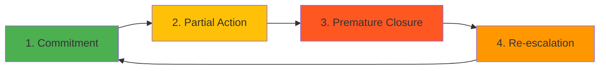

# Visual Design Review: LinkedIn Post #1 — Risk Register Dysfunction

**Post Type:** LinkedIn text post
**Visual Budget:** 1-2 optional visuals (LinkedIn text posts work well standalone)

---

## Visual Opportunities

LinkedIn text posts typically perform best without attached images (LinkedIn's algorithm favors native text). However, if you want to amplify reach or create a companion visual for cross-posting, here are the opportunities:

---

### Option 1: Companion Graphic (Optional)

**Type:** Quote card / Key insight graphic
**Purpose:** Shareable social media asset for Twitter, Instagram, or LinkedIn carousel

**Concept:**
A clean, minimal design featuring the hook or key insight as text overlay on a simple background.

**Text options (choose one):**
1. "A commitment without a resource allocation is just a neglected meeting outcome."
2. "The gap is comfort. A risk on a register feels managed."
3. "You don't have a risk management problem. You have an engineering management problem that nobody's treating like one."

**Visual approach:**
- **Background:** Simple gradient or solid color (brand-consistent with bksp.ca)
- **Text:** Large, bold, high-contrast typography (white text on dark background, or vice versa)
- **Branding:** Small "bksp.ca" or "@[your-linkedin-handle]" in corner
- **Dimensions:** 1080x1080px (square for Instagram) or 1200x630px (landscape for LinkedIn/Twitter)

**Suggested tool:** Canva (template: Quote post) or Figma

**Note:** This is OPTIONAL. LinkedIn text posts often perform better without attached media. Only use if you want a shareable asset for other platforms or to test engagement with/without visual.

---

### Option 2: Diagram — The Dysfunction Loop (Optional)

**Type:** Flow chart / Circular diagram
**Purpose:** Visualize the 4-step cycle described in the post

**What to show:**
A circular flow diagram with 4 nodes:
1. **Commitment** → 2. **Partial Action** → 3. **Premature Closure** → 4. **Re-escalation** → (back to 1)

**Visual style:**
- Circular arrows showing the loop
- Each step labeled clearly
- Optional: Add a "breaking point" graphic showing where the cycle should stop but doesn't
- Color-code each step (e.g., green → yellow → red → orange, looping back)

**Suggested tool:** Mermaid.js, Excalidraw, or Canva

**Mermaid.js sketch:**

**When to use:** If posting as a LinkedIn carousel (multi-image post), this could be slide 2 (after a title slide with the hook). But for a standalone text post, skip this.

---

### Option 3: Data Visualization — Ticket Age Distribution (Not Recommended)

**Type:** Bar chart showing ticket age
**Concept:** Hypothetical chart showing "Critical Severity Tickets by Age" with bars for 0-3mo, 3-6mo, 6-12mo, 12-24mo, 24mo+

**Why NOT recommended:**
- The post doesn't provide specific data, so any chart would be illustrative/hypothetical
- Adding a made-up chart would undermine the evidence-first voice
- The post is strong enough without visual proof

**Alternative:** If you have real (anonymized) data from your own risk registers, this could be a powerful visual. But without data, skip it.

---

## Social Media Card (For Future Blog Cross-Post)

If this post becomes a blog post or longer article later, you'll want an Open Graph card:

**Concept:** Simple text-based card with the hook as the headline
**Key text overlay:** "A commitment without a resource allocation is just a neglected meeting outcome."
**Visual element:** Minimal background (gradient or abstract shapes), high-contrast text
**Dimensions:** 1200x630px (Open Graph standard)
**Branding:** "bksp.ca" in footer

---

## Recommendation

**For initial LinkedIn post: No visual.**

LinkedIn's algorithm favors native text posts without links or attached media. Your post is strong enough to stand alone. Adding a visual would likely reduce reach.

**For amplification (later):**
- If the post performs well, create a quote card graphic (Option 1) and post it separately a few days later as a carousel or standalone image post
- If you're cross-posting to Twitter/Instagram, use the quote card graphic there

**Visual readiness verdict:** N/A (text post, no visual required)

---

## Implementation Priority

1. **Do first:** Post as plain text (no visual)
2. **Optional (post-publish):** Create quote card if post gets 100+ reactions
3. **Skip:** Diagram and data viz (not needed for this format)

---

**Bottom line:** Ship this as a text post. No visual needed.
