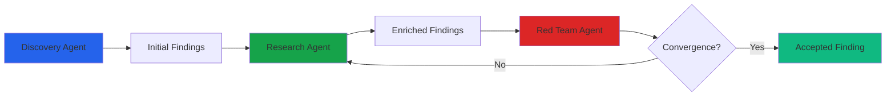

# Visual Design Review: LinkedIn Post #3 - I Built an AI Red Team That Argues With Itself

**Post Type:** LinkedIn text post
**Visual Budget:** 1-2 optional visuals (text posts perform best, but this technical content could benefit from a diagram)

---

## Visual Opportunities

This post is more technical than Posts #1 and #2, which creates an opportunity for a visual that clarifies the architecture. However, LinkedIn text posts still perform better without media, so this is optional.

---

### Option 1: Architecture Diagram (Recommended IF Using a Visual)

**Type:** Flow diagram showing agent interaction
**Purpose:** Visualize the discovery → research → red team → convergence loop

**What to show:**
- **Discovery Agent** → scans sources → generates findings
- **Research Agent** → enriches findings → adds citations
- **Red Team Agent** → reviews → CRITICIZE / ENDORSE / REFINE
- **Loop back to Research** → respond to critiques → red team reviews again
- **Convergence** → threshold met → finding accepted

**Visual style:**
- Clean flow chart with boxes and arrows
- Color-code agents (e.g., discovery = blue, research = green, red team = red)
- Show loop with curved arrow
- Highlight convergence threshold as decision point

**Suggested tools:**
- Mermaid.js (can embed in markdown later for blog expansion)
- Excalidraw (quick hand-drawn style)
- Canva (polished, easy to create)

**Mermaid.js sketch:**

**When to use:** If you want to test whether technical posts perform better with a visual on LinkedIn. Most text posts perform better without, but this is complex enough that a diagram might help.

**When NOT to use:** If you want to maximize reach. Plain text posts get better LinkedIn algorithm treatment.

---

### Option 2: Quote Card (Alternative)

**Type:** Text-based social media card
**Purpose:** Shareable asset for Twitter, Instagram, or later LinkedIn posts

**Text options (choose one):**
1. "The models don't get smarter. The system around them gets more disciplined."
2. "Add an adversary to your pipeline. The quality difference is not incremental. It's structural."
3. "The first draft from any LLM is confident and wrong in ways that are hard for humans to catch."

**Visual approach:**
- **Background:** Dark (#0a0f1a matching bksp.ca)
- **Text:** Large, bold, high-contrast (white on dark)
- **Branding:** "bksp.ca" in corner
- **Dimensions:** 1080x1080px (square) or 1200x630px (landscape)

**Suggested tool:** Canva or Figma

**Note:** This is OPTIONAL. Use only for cross-posting to Twitter/Instagram or if the LinkedIn post performs well and you want to amplify with a quote card later.

---

### Option 3: Before/After Comparison Table

**Type:** Side-by-side comparison
**Concept:** "First Draft LLM Output" vs. "After Adversarial Review"

**Columns:**
- Left: First draft (vague findings, no citations, hallucinated CVEs)
- Right: After adversarial review (3x more citations, no hallucinations, quantified evidence)

**Why NOT recommended:**
- Requires real examples (can't show actual LLM output without revealing internal data)
- Could be too busy for LinkedIn post format
- Better saved for a blog post expansion where you can show real examples

---

## Recommendation

**For initial LinkedIn post: No visual** (or architecture diagram if testing visual performance).

**Option A (Recommended): Plain text**
- LinkedIn algorithm favors native text posts
- Post is clear enough without a diagram
- Saves the visual for later (blog post expansion)

**Option B (Testing): Architecture diagram**
- If you want to test whether technical content performs better with a visual
- Use simple flow diagram (Mermaid.js or Excalidraw)
- Risk: may reduce reach compared to plain text

**My recommendation:** Post as plain text first. If it performs well (100+ reactions), create an architecture diagram and post it separately as a follow-up ("Here's how the architecture works in more detail").

---

## Social Media Card (For Future Blog Post)

If this post becomes a blog post later:

**Concept:** Architecture diagram as hero image
**Visual:** Flow chart showing discovery → research → red team → convergence loop
**Dimensions:** 1200x630px (Open Graph standard)
**Branding:** "bksp.ca" in footer

---

## Implementation Priority

1. **Do first:** Post as plain text (no visual)
2. **Optional (if testing):** Create simple architecture diagram and attach to post
3. **Optional (post-publish):** Create architecture diagram as follow-up post if initial post gets 100+ reactions
4. **Skip:** Quote card and comparison table (save for blog post expansion)

---

**Bottom line:** Ship as plain text unless you specifically want to test visual performance for technical content. The architecture is described clearly enough in prose.
