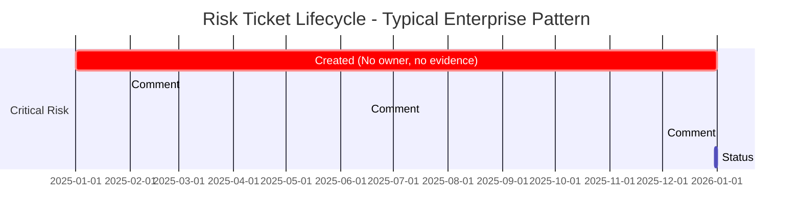

My first week in risk management, I opened the risk register and found critical-severity tickets with no evidence, no quantified impact, no definition of what remediation would look like, and no owner. Some had been open for over a year. The comment history was a graveyard of good intentions — people agreeing the risk was important, committing to action, then going silent.

I'd been spending my nights on HackTheBox — practicing breaking into systems with real tools and real methodology. In that world, this would be like running nmap, seeing port 80 open, typing "this could be bad" into your notes, and moving on to the next box.

### The Mapping

The methodology I use to root an HTB machine maps almost exactly to what's missing from most enterprise risk programs.

| HTB Methodology | Enterprise Risk Management | Current Gap |
|---|---|---|
| **Enumeration before assumption** Port scan, service detection, define attack surface with specificity | **Evidence-based scoping** Document affected systems, quantify exposure, define scope precisely | ⚠️ "We think this is medium-severity" (intuition, not data) |
| **Proof before claims** Show the shell, data exfiltration, privilege escalation | **Quantified impact** Affected user count, regulatory framework, documented incidents | ⚠️ "Could result in significant exposure" (claim without evidence) |
| **Documentation that reproduces** Walkthrough methodology, show dead ends, enable reproduction | **Reproducible analysis** Evidence trail, methodology shown, severity derivation documented | ⚠️ "Severity: High. Fix it." (conclusion without reasoning) |
| **Chains, not silos** Pivot through attack paths, map lateral movement | **Attack chain mapping** Link vulnerabilities across systems, map exploitation paths | ⚠️ Each risk evaluated in isolation (no chain analysis) |

**Enumeration before assumption**

On HTB, you start with nmap and you don't stop. Port scan, service detection, directory brute-forcing, subdomain discovery. You're defining the attack surface with specificity before you form a hypothesis.

Most risk programs skip this entirely. They start with assumptions: "this system is probably fine" or "we think this is medium-severity." The tickets I've inherited have a one-paragraph description that hasn't been updated since filing. The scope is "somewhere between annoying and catastrophic" — which is the same as having no scope at all. Just intuition dressed up as assessment.

An HTB player would never submit a writeup that says "I assumed the web server was vulnerable." You prove it or you move on.

**Proof before claims**

On HTB, exploitation is proof. You don't claim a vulnerability exists — you demonstrate it. You show the shell, the data exfiltration, the privilege escalation. The proof is the point.

In risk management, quantifying impact should work the same way. Not "this could result in significant financial exposure" — but "here's the number of affected users, here's the regulatory framework that applies, and here are the documented incidents showing active exploitation." Evidence. Citations. Numbers.

The gap between "this could be bad" and "here's exactly how bad, with proof" is the gap between a risk register that drives decisions and one that collects dust.

**Documentation that reproduces**

In the HTB community, writeups are sacred. A good writeup doesn't just say "I got root." It walks through the methodology, explains the reasoning at each step, shows the dead ends and what you learned from them, and provides enough detail for someone else to reproduce the work.

Most risk reports I've read do the opposite. They summarize conclusions without showing the evidence trail. They skip the methodology. They present a severity rating without showing how it was derived. If an HTB writeup read like a typical risk assessment, it would say: "The machine was vulnerable. Severity: High. Recommendation: Fix it."

That writeup would get roasted in the community. But that's what passes for risk reporting in most enterprises.

**Chains, not silos**

This is where HTB Pro Labs changed how I think about risk.

On a single HTB machine, exploitation is usually linear: foothold → user → root. But in a Pro Lab — a simulated enterprise network — you pivot. You take credentials from one machine and use them to move laterally. You escalate from a web server to a domain controller through a chain of misconfigurations that no single team would have caught.

Enterprise risk works the same way. A single vulnerability in isolation might be medium-severity. But chain it with a missing logging control and an unmonitored service account, and you've got a path from initial access to domain admin. Most risk programs evaluate each risk in isolation, filed by the team that found it, reviewed in a silo. Nobody maps the chain.

Pro Labs taught me to think in attack chains. Risk management should too.

### The Engineer's Advantage

I'm not arguing that every risk manager needs to be a penetration tester. But the methodology transfers better than people think: evidence-based scoping, quantified impact, named owners, defined acceptance criteria, regression verification. The engineers and ethical hackers moving into security leadership right now have an opportunity to bring that discipline with them. Risk tickets don't close because the risk goes away. They close because someone finally has the structure to make a decision.

### The Bottom Line

HackTheBox taught me that every system has an attack path if you're methodical enough to find it. Risk management taught me that most organizations already know their attack paths — they just don't have the methodology to do anything about them.

If you're an engineer or ethical hacker moving into risk management, you'll be tempted to think the methodology doesn't apply — that business risk is softer, less structured, less provable. It isn't. The systems are messier, but the discipline is identical. Enumerate. Prove. Document.

The risk register is just another box. Root it.

---

`bksp_ // enumerate. prove. document.`
